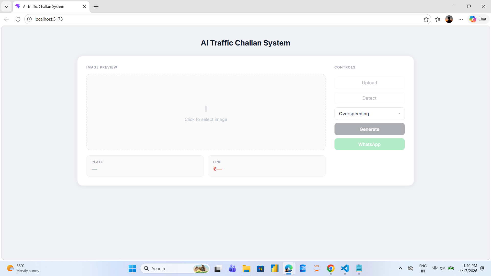
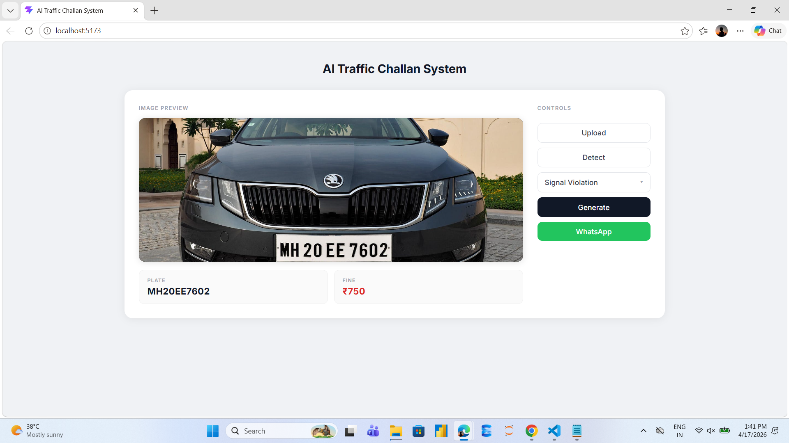
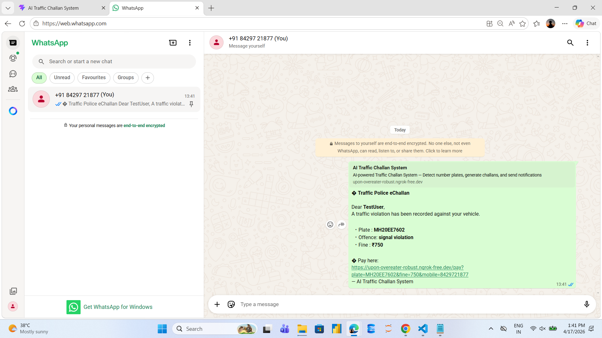
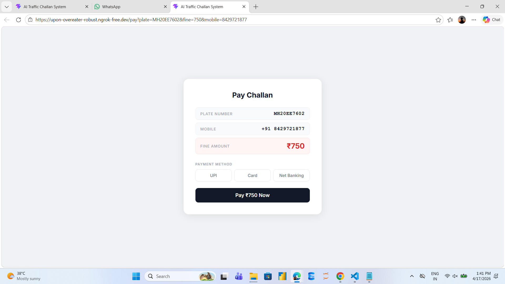

# 🚔 AI Traffic Challan System

An end-to-end intelligent system that automates traffic violation processing — from number plate recognition to WhatsApp payment notifications.

---

## 📸 Screenshots

### 🚘 Main Dashboard


### 🔍 Plate Detection


### 📋 Challan Generated


### 💬 WhatsApp Notification


### 💳 Payment Page

## ✨ Features

- 🔍 **Automatic Number Plate Recognition** using EasyOCR + OpenCV
- 📋 **Instant Challan Generation** with owner details lookup from database
- 📱 **Real-time WhatsApp Notifications** with dynamic payment links
- 💳 **Online Payment Interface** built with React
- 🗄️ **SQLite Database** for storing challans and vehicle records
- ⚡ **Full-stack pipeline** — AI Model → FastAPI Backend → React Frontend

---

## 🛠 Tech Stack

| Layer     | Technology                        |
|-----------|-----------------------------------|
| Frontend  | React, Vite                       |
| Backend   | Python, FastAPI, Uvicorn          |
| AI / CV   | EasyOCR, OpenCV                   |
| Database  | SQLite                            |
| Messaging | WhatsApp API (wa.me links)        |

---

## 📁 Project Structure

```
ai-traffic-challan-system/
├── backend/
│   ├── main.py                 # FastAPI app entry point
│   ├── routers/
│   │   └── challan.py          # API routes
│   ├── services/
│   │   ├── database.py         # DB init and queries
│   │   ├── detection.py        # OCR + plate detection logic
│   │   └── challan_service.py  # Challan generation logic
│   └── uploads/                # Uploaded images stored here
│       └── plates/             # Cropped plate images
└── frontend/
    ├── src/
    │   ├── App.jsx              # Main UI component
    │   ├── api/
    │   │   └── challanApi.js    # API call functions
    │   └── pages/
    │       └── PayPage.jsx      # Payment page
    ├── index.html
    └── vite.config.js
```

---

## ⚙️ Setup & Installation

### Prerequisites

- Python 3.9+
- Node.js 18+
- pip

---

### 1. Clone the Repository

```bash
git clone https://github.com/thepunitchaudhary/ai-traffic-challan-system.git
cd ai-traffic-challan-system
```

---

### 2. Backend Setup

```bash
cd backend

# Create and activate virtual environment
python -m venv venv

# Windows
venv\Scripts\activate

# macOS / Linux
source venv/bin/activate

# Install dependencies
pip install -r requirements.txt

# Run the backend server
uvicorn main:app --reload
```

Backend runs at: `http://localhost:8000`

---

### 3. Frontend Setup

```bash
cd frontend

# Install dependencies
npm install

# Start the dev server
npm run dev
```

Frontend runs at: `http://localhost:5173`

---

### 4. `requirements.txt` (Backend)

```
fastapi
uvicorn[standard]
python-multipart
easyocr
opencv-python
Pillow
requests
```

---

## 🔄 How It Works

```
1. Upload vehicle image
        ↓
2. Detect number plate (EasyOCR + OpenCV)
        ↓
3. Fetch owner details from database
        ↓
4. Select violation type + Generate challan
        ↓
5. Send WhatsApp message with payment link
        ↓
6. Owner pays via the React payment page
```

---

## 🌐 API Endpoints

| Method | Endpoint              | Description                        |
|--------|-----------------------|------------------------------------|
| POST   | `/upload`             | Upload vehicle image               |
| POST   | `/detect-plate`       | Detect number plate from image     |
| POST   | `/generate-challan`   | Generate challan for a violation   |
| GET    | `/challan/{plate}`    | Fetch challan by plate number      |

---

## 🙏 Acknowledgements

- **Mentor:** [@OmkarNallagoni](https://github.com/OmkarNallagoni) — for guidance and support throughout the project
- [EasyOCR](https://github.com/JaidedAI/EasyOCR) — for the OCR engine
- [FastAPI](https://fastapi.tiangolo.com/) — for the backend framework

---

## 📄 License

This project is licensed under the [MIT License](LICENSE).

---

## 👤 Author

**Punit CKumar**  
GitHub: [@thepunitchaudhary](https://github.com/thepunitchaudhary)

---

> ⭐ If you found this project useful, consider giving it a star!
